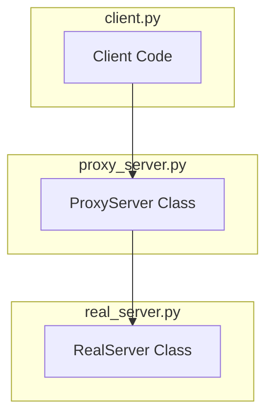

## python-projects
* This project is on proxy design pattern
* Here you have 3 files
  -  `client.py` imports `ProxyServer` and connects through it.

  -  `proxy_server.py` imports `RealServer` and delegates the work.

  - `real_server.py` performs the actual web request and prints data.

### How it works


Note:- The terminal must be opened in the project folder
In your terminal or VS Code run as follows:

```shell

python client.py

```
---
#### Simple and clear diagram that shows how the three .py files interact in this Proxy Design Pattern example.



